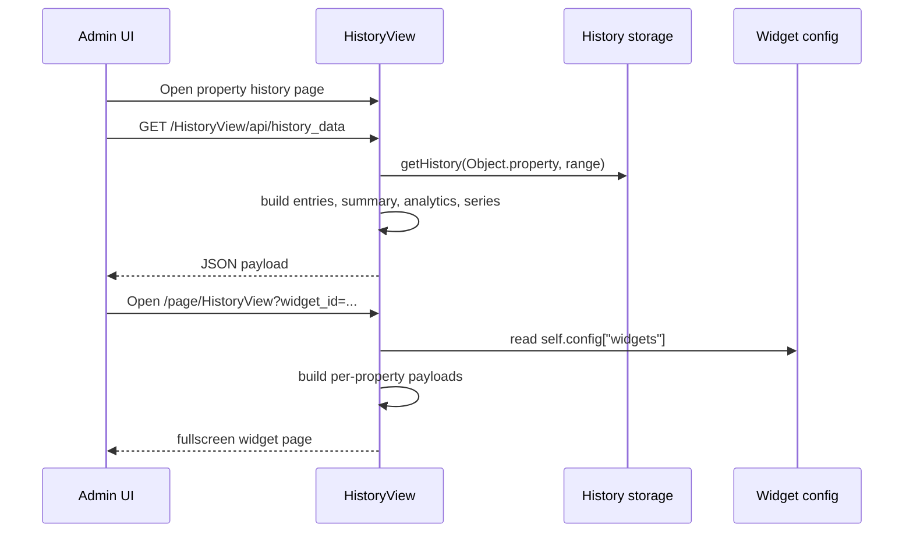
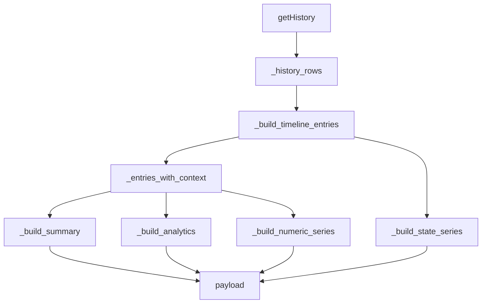

# HistoryView - Technical Reference

## Module Structure

Core files:

| File | Responsibility |
| --- | --- |
| `plugins/HistoryView/__init__.py` | Main plugin lifecycle, history API, widget building, search, admin actions |
| `plugins/HistoryView/templates/history.html` | Property history page with charts, analytics, filters, and export |
| `plugins/HistoryView/templates/widget_form.html` | Widget create/edit form |
| `plugins/HistoryView/templates/widgets_list.html` | Admin widget list |
| `plugins/HistoryView/templates/widget_history.html` | Reusable widget renderer |
| `plugins/HistoryView/templates/widget_page.html` | Fullscreen single-widget page |
| `plugins/HistoryView/templates/widgets_page_list.html` | Fullscreen widget catalog |
| `plugins/HistoryView/translations/*.json` | UI labels |
| `plugins/HistoryView/static/highcharts/*` | Bundled charting libraries |

---

## Runtime Overview

`HistoryView` has three user-facing action families:

- `widget`
- `page`
- `search`

and one dedicated data endpoint:

- `GET /HistoryView/api/history_data`



---

## Plugin Metadata

| Field | Value |
| --- | --- |
| `title` | `History` |
| `description` | `History viewer` |
| `category` | `System` |
| `version` | `2.0` |
| `actions` | `["widget", "page", "search"]` |

---

## Action Behavior

### `widgets()`

Returns a compact list of configured widgets in the form:

```json
[
  {
    "name": "c8a2c5d2-7a7a-4e2b-9f96-8e541b0b57cd",
    "description": "Boiler temperatures"
  }
]
```

This list is used by the platform to discover renderable widget instances.

### `widget(name, _settings)`

- resolves the widget by `id`;
- builds property payloads for all linked properties;
- renders `templates/widget_history.html`;
- returns an empty string if the widget does not exist.

### `page(request)`

Two modes:

| Request shape | Result |
| --- | --- |
| `/page/HistoryView` | Renders `widgets_page_list.html` |
| `/page/HistoryView?widget_id=<id>` | Renders `widget_page.html` |

Aliases `id` and `name` are also accepted for widget lookup.

### `search(query)`

Searches through all configured widgets and returns result cards pointing to `/page/HistoryView?widget_id=<id>`.

Search can match:

- widget name;
- serialized property definitions;
- linked property names.

Each result includes tags such as `History Widget`, chart type, and up to three matched property names.

---

## History API

Namespace path:

```text
/HistoryView/api/history_data
```

Method:

```text
GET
```

Access:

- admin permission required;
- handled by `handle_admin_required`.

### Query parameters

| Parameter | Required | Meaning |
| --- | --- | --- |
| `object` | Yes | Object name |
| `property` | Yes | Property name |
| `dt_begin` | No | ISO-like start datetime |
| `dt_end` | No | ISO-like end datetime |
| `period` | No | Fallback lookback in hours |
| `bucket` | No | `auto`, `raw`, `5m`, `15m`, `1h`, `6h`, `1d` |
| `include_compare` | No | `true` by default, `false` disables previous-period comparison |

### Example request

```text
/HistoryView/api/history_data?object=Climate&property=outdoor_temp&period=24&bucket=auto
```

### Success envelope

```json
{
  "success": true,
  "result": {
    "object_name": "Climate",
    "property_name": "outdoor_temp"
  }
}
```

### Error cases

| Case | Status | Response shape |
| --- | --- | --- |
| Missing object or property | `400` | `{"success": false, "message": "Missing object or property"}` |
| Invalid range | `400` | `{"success": false, "message": "..."}` |
| Unexpected build failure | `500` | `{"success": false, "message": "Failed to build history data"}` |

> [!NOTE]
> `dt_begin > dt_end` is explicitly rejected.

---

## Range Resolution

`_resolve_range(...)` applies the following logic:

1. `dt_end` defaults to `datetime.now()` if not provided.
2. `dt_begin` is parsed directly when present.
3. If `dt_begin` is absent and `period > 0`, `dt_begin = dt_end - period hours`.
4. If both are set and `dt_begin > dt_end`, a `ValueError` is raised.

Input parsing uses `datetime.fromisoformat(...)` after trimming whitespace and removing trailing `Z`.

---

## Property Resolution and Validation

`_get_property_manager(object_name, property_name)`:

- looks up the object in `objects_storage`;
- verifies that the property exists;
- raises a `ValueError` if either object or property is missing.

`_get_property_label(...)` produces a user-facing label:

```text
<object description or object name> - <property description or property name>
```

---

## Data Preparation Pipeline

The core builder is `_build_property_payload(...)`.

### Processing stages

1. Resolve object and property metadata.
2. Load raw rows with `getHistory(...)`.
3. Normalize timestamps and source names.
4. Build a timeline that may prepend a synthetic row at `dt_begin`.
5. Enrich each entry with:
   - display value
   - numeric value
   - delta
   - transition text
   - state duration
   - current-age duration
6. Determine rendering mode.
7. Build numeric and state series.
8. Build summary counters and distributions.
9. Build analytics.
10. Optionally build previous-period comparison.



---

## Value Normalization Rules

### `_parse_numeric(value)`

Supported conversions:

| Input | Result |
| --- | --- |
| `True` / `False` | `1.0` / `0.0` |
| `int`, `float` | floating-point value if finite |
| `"true"` / `"false"` | `1.0` / `0.0` |
| numeric string | parsed float |
| `NaN`, infinity, invalid text | `None` |

### `_display_value(value)`

Rules:

- booleans become `"True"` / `"False"`;
- dicts and lists are serialized with `json.dumps(..., ensure_ascii=False, sort_keys=True)`;
- `None` becomes `"None"`;
- everything else becomes `str(value)`.

### `_format_duration(seconds)`

Produces labels such as:

- `45s`
- `12m 4s`
- `3h 20m`
- `1d 2h 5m`

---

## Mode Detection

`_determine_mode(prop_type, chart_type, entries)` selects:

| Mode | Condition |
| --- | --- |
| `distribution` | Widget chart type is `pie` |
| `boolean` | Property type is `bool` |
| `numeric` | At least one entry has a numeric value |
| `state` | Fallback for non-numeric values |

In the history API path, the current implementation passes `chart_type=None`, so `distribution` is mainly relevant for widget rendering decisions rather than direct property payload generation.

---

## Bucketing Strategy

`_choose_bucket(...)` uses the following heuristic:

| Condition | Bucket |
| --- | --- |
| Explicit non-`auto` bucket | that bucket |
| `count <= 500` | `raw` |
| Unknown range | `1h` |
| target spacing <= 5 min | `5m` |
| target spacing <= 15 min | `15m` |
| target spacing <= 1 hour | `1h` |
| target spacing <= 6 hours | `6h` |
| otherwise | `1d` |

Numeric bucketing computes average value per bucket and rounds it to four decimals.

> [!TIP]
> For forensic use or exact point plotting, request `bucket=raw`.

---

## Timeline Enrichment

`_build_timeline_entries(...)` may inject a synthetic row at the range start if there is a previous historical value before `dt_begin`. This is important for:

- state timelines;
- correct duration calculations;
- binary active-time analytics.

Each enriched entry can include:

| Field | Meaning |
| --- | --- |
| `display_value` | User-facing string form |
| `numeric_value` | Numeric interpretation if possible |
| `previous_value` | Raw previous value |
| `previous_display_value` | Previous string form |
| `transition` | `<previous> -> <current>` |
| `changed` | Boolean change flag |
| `delta_numeric` | Numeric difference to previous value |
| `delta_display` | Signed string version of delta |
| `duration_seconds` | How long the state lasted |
| `duration_label` | Human-readable state duration |
| `changed_for_seconds` | How long the current value has been active |
| `changed_for_label` | Human-readable current-age duration |

---

## Summary Calculation

`_build_summary(...)` produces:

| Field | Meaning |
| --- | --- |
| `count` | Number of rows in the selected range |
| `changes_count` | Number of rows marked as changed |
| `distinct_values_count` | Number of distinct display values |
| `distinct_sources_count` | Number of distinct sources |
| `last_value` | Latest display value |
| `last_source` | Latest source |
| `last_changed` | Latest timestamp |
| `changed_for_label` | How long the latest value has lasted |
| `first_value` | First display value in range |
| `first_changed` | First timestamp in range |
| `change_rate_per_hour` | Rows per hour over the span |
| `min_value`, `max_value`, `avg_value` | Numeric aggregates if possible |
| `delta_total` | Difference between first and last numeric values |
| `top_source` | Most common source |
| `top_value` | Most common display value |

Distributions are also prepared for:

- sources;
- values;
- state durations.

---

## Analytics Calculation

`_build_analytics(...)` produces several derived structures.

### Generic analytics

- `hourly_activity`
- `top_jumps`
- `stats.median`
- `stats.p10`
- `stats.p90`
- `stats.stddev`
- `min_point`
- `max_point`
- `daily_profile`
- `trend`

### Counter-like detection

The data is considered counter-like when:

- numeric entries exist;
- at least `80%` of deltas are non-negative;
- total numeric delta over the range is non-negative.

If that holds, the payload adds:

```json
{
  "counter": {
    "is_counter_like": true,
    "increment_total": 123.45,
    "avg_increment_per_hour": 5.14,
    "increment_profile": [[0, 0], [1, 2.5]]
  }
}
```

### Binary analytics

When timeline values are effectively `0/1`, the payload adds:

- `active_seconds`
- `active_label`
- `activation_count`
- `avg_active_seconds`
- `avg_active_label`
- `longest_active_seconds`
- `longest_active_label`
- `active_profile`

> [!IMPORTANT]
> Binary analytics are based on the timeline with durations, not only on raw change rows. This makes them meaningful for on/off properties.

---

## Previous-Period Comparison

`_comparison_summary(...)` is only built when both `dt_begin` and `dt_end` are known and the range duration is positive.

The previous window is:

```text
previous_begin = dt_begin - (dt_end - dt_begin)
previous_end   = dt_begin
```

The comparison returns:

| Field | Meaning |
| --- | --- |
| `dt_begin`, `dt_end` | Previous interval |
| `count` | Previous row count |
| `avg_value` | Previous numeric average |
| `last_value` | Previous latest display value |
| `change_rate_per_hour` | Previous rate |

The current summary may additionally expose:

- `count_vs_previous`
- `avg_vs_previous`

---

## Payload Structure

High-level payload returned in `result`:

```json
{
  "object_name": "Climate",
  "object_description": "Climate",
  "property_name": "outdoor_temp",
  "property_description": "Outdoor temperature",
  "property_label": "Climate - Outdoor temperature",
  "property_type": "float",
  "history_enabled": true,
  "mode": "numeric",
  "range": {
    "dt_begin": "2026-03-26T12:00:00",
    "dt_end": "2026-03-27T12:00:00"
  },
  "entries": [],
  "summary": {},
  "compare_previous": {},
  "series": {
    "numeric": [],
    "numeric_bucket": "raw",
    "state": [],
    "state_categories": [],
    "source_pie": [],
    "value_pie": [],
    "duration_column": []
  },
  "distributions": {
    "sources": [],
    "values": [],
    "durations": []
  },
  "analytics": {}
}
```

### Series semantics

| Series field | Shape | Meaning |
| --- | --- | --- |
| `numeric` | `[[timestamp_ms, value], ...]` | Numeric chart points |
| `numeric_bucket` | string | Effective bucket used |
| `state` | `[[timestamp_ms, categoryIndex], ...]` | State timeline |
| `state_categories` | `["Idle", "Run"]` | Labels for state series |
| `source_pie` | `[[name, count], ...]` | Source distribution |
| `value_pie` | `[[name, count], ...]` | Value distribution |
| `duration_column` | `[[name, seconds], ...]` | Total time per state |

---

## Widget Configuration Format

Widgets are stored in `self.config["widgets"]`.

### Minimal legacy form

```json
{
  "id": "1f2e3d4c",
  "name": "Boiler",
  "period": 24,
  "properties": [
    "Boiler.temp"
  ],
  "chart_type": "line",
  "show_legend": true,
  "show_navigator": true,
  "show_range_selector": true,
  "show_context_menu": false
}
```

### Extended form with per-series overrides

```json
{
  "id": "1f2e3d4c",
  "name": "Climate overview",
  "period": 24,
  "properties": [
    {
      "name": "LivingRoom.temperature",
      "chart_type": "line",
      "color": "#DA690A"
    },
    {
      "name": "LivingRoom.humidity",
      "chart_type": "area",
      "color": "#0969DA"
    }
  ],
  "chart_type": "line",
  "show_legend": true,
  "show_navigator": true,
  "show_range_selector": true,
  "show_context_menu": true
}
```

### Widget property normalization

`_build_widget_context(...)` accepts:

- plain strings like `Object.property`;
- dictionaries with `name`;
- dictionaries with `object + property`.

It normalizes them into:

```json
{
  "name": "Object.property",
  "chart_type": "line",
  "color": "#DA690A"
}
```

---

## Widget Rendering Behavior

`templates/widget_history.html` builds the final chart as follows:

- reads all property payloads prepared server-side;
- chooses a common effective mode using the first payload;
- treats boolean payloads as numeric for widget rendering;
- merges state categories across payloads when needed;
- applies per-series `chart_type` and `color` overrides;
- uses `widgetConfig.chart_type` as the fallback type;
- switches to a pie chart when the widget itself is `pie`.

### Pie widget specifics

For `pie` widgets, data is built from `payload.series.value_pie`, not from the time series itself.

### Stock chart specifics

For non-pie widgets, `Highcharts.stockChart(...)` is used and the following flags are respected:

- `show_legend`
- `show_navigator`
- `show_range_selector`
- `show_context_menu`

---

## Admin Operations

The `admin(request)` handler supports several `op` modes.

| `op` | Method | Behavior |
| --- | --- | --- |
| `create_widget` | `GET` | Opens empty widget form |
| `edit_widget` | `GET` | Opens widget form with existing data |
| `delete_widget` | `GET` | Removes a widget from config and saves |
| `save_widget` | `POST` | Creates or updates a widget |
| `delete` | `GET` | Deletes one history row by `History.id` |
| none + no object | `GET` | Opens widget list |
| none + object | `GET` | Opens `history.html` for the selected object/property |

### Save-widget parsing rules

The form prefers `properties_json` when present.

Fallback behavior:

- if `properties_json` is invalid or empty, the module falls back to comma-separated `properties`;
- each saved property dict keeps `name`, `chart_type`, and `color`;
- when editing an existing widget, the obsolete `height` key is removed.

> [!WARNING]
> `period` is parsed with `int(...)` directly from form input. Invalid form values would raise before save completes.

---

## Search Result Shape

`search(query)` returns a list of objects like:

```json
[
  {
    "url": "/page/HistoryView?widget_id=1f2e3d4c",
    "title": "Climate overview",
    "tags": [
      {"name": "History Widget", "color": "info"},
      {"name": "line", "color": "secondary"},
      {"name": "LivingRoom.temperature", "color": "success"}
    ]
  }
]
```

---

## Frontend Notes

### `history.html`

The property page frontend is responsible for:

- calling the history API;
- choosing the main chart type in the UI;
- rendering analytics cards and side charts;
- filtering table rows in-browser;
- exporting CSV;
- adapting Highcharts colors to the active theme.

It also includes a client-side analytics fallback in case some analytics fields are absent from the server response.

### `widget_form.html`

The widget editor:

- loads object details from `/api/object/list/details`;
- uses Vue 2 and `select-with-filter`;
- serializes selected properties into hidden fields before submit.

---

## Known Caveats

- Widget rendering assumes each property name can be split by the first `.` into object and property parts.
- A broken widget property reference can cause widget page rendering to fail because `_build_property_payload(...)` validates object and property existence strictly.
- The history row delete operation is a plain `GET` action from the admin handler.
- `negative_deltas` is computed inside analytics but not used later in the current implementation.
- Some visible labels in templates are hardcoded rather than fully localized.

> [!CAUTION]
> Because widget data is built server-side for every linked property, very large widgets or very wide periods may become expensive compared to a single-property page.

---

## Summary

`HistoryView` is a hybrid of:

- history browser;
- charting module;
- lightweight analytics engine;
- widget builder;
- widget search provider.

See also:

- [User Guide](USER_GUIDE.md)
- [Module index](index.md)
