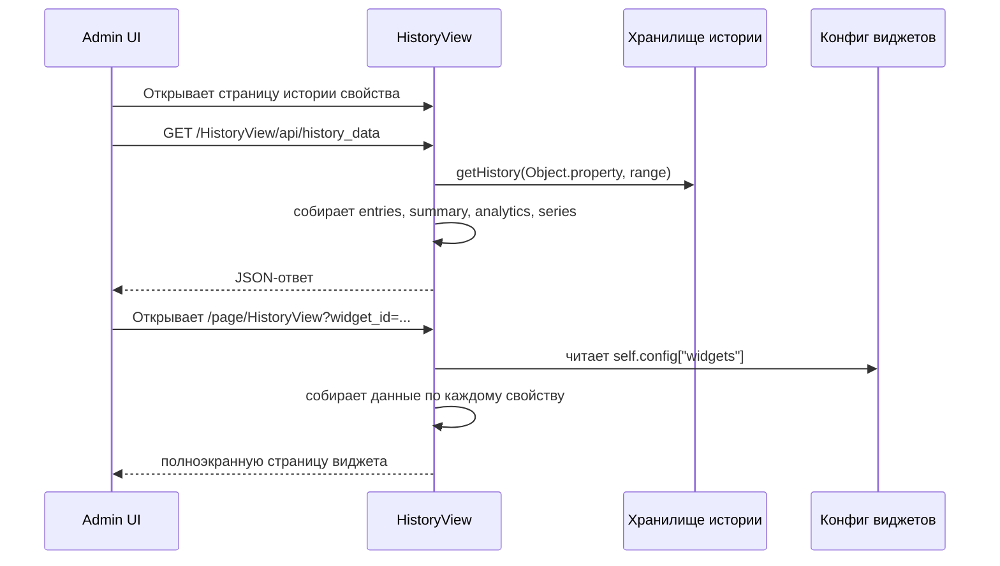
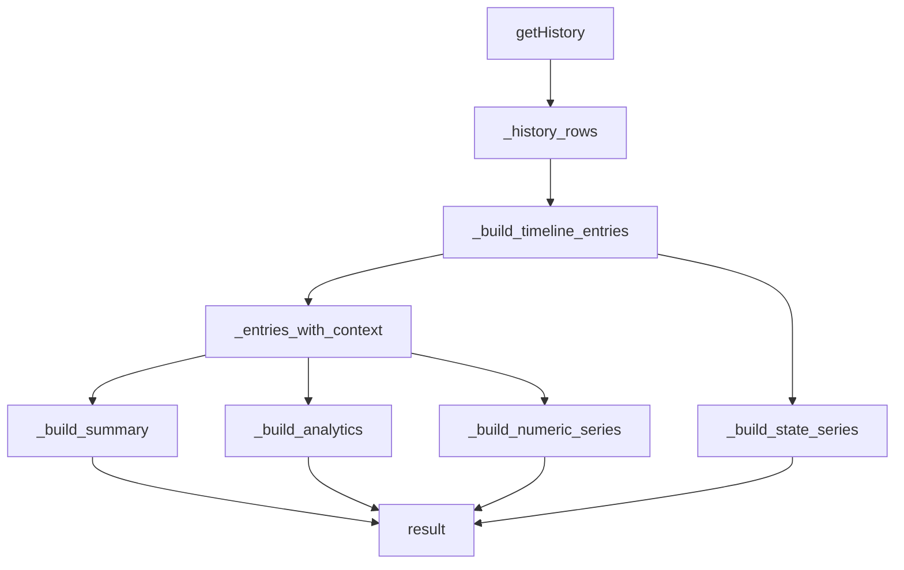

# HistoryView - Техническое описание

## Структура модуля

Основные файлы:

| Файл | Ответственность |
| --- | --- |
| `plugins/HistoryView/__init__.py` | Жизненный цикл плагина, history API, построение виджетов, поиск, действия админки |
| `plugins/HistoryView/templates/history.html` | Страница истории свойства с графиками, аналитикой, фильтрами и экспортом |
| `plugins/HistoryView/templates/widget_form.html` | Форма создания и редактирования виджета |
| `plugins/HistoryView/templates/widgets_list.html` | Административный список виджетов |
| `plugins/HistoryView/templates/widget_history.html` | Переиспользуемый рендерер виджета |
| `plugins/HistoryView/templates/widget_page.html` | Полноэкранная страница одного виджета |
| `plugins/HistoryView/templates/widgets_page_list.html` | Полноэкранный каталог виджетов |
| `plugins/HistoryView/translations/*.json` | Подписи интерфейса |
| `plugins/HistoryView/static/highcharts/*` | Встроенные библиотеки графиков |

---

## Общая схема выполнения

У `HistoryView` три пользовательских семейства действий:

- `widget`
- `page`
- `search`

и один специализированный маршрут данных:

- `GET /HistoryView/api/history_data`



---

## Метаданные плагина

| Поле | Значение |
| --- | --- |
| `title` | `History` |
| `description` | `History viewer` |
| `category` | `System` |
| `version` | `2.0` |
| `actions` | `["widget", "page", "search"]` |

---

## Поведение действий

### `widgets()`

Возвращает компактный список настроенных виджетов в виде:

```json
[
  {
    "name": "c8a2c5d2-7a7a-4e2b-9f96-8e541b0b57cd",
    "description": "Boiler temperatures"
  }
]
```

Этот список используется платформой для обнаружения доступных экземпляров виджетов.

### `widget(name, _settings)`

- находит виджет по `id`;
- строит данные для всех связанных свойств;
- рендерит `templates/widget_history.html`;
- возвращает пустую строку, если виджет не найден.

### `page(request)`

Два режима:

| Вид запроса | Результат |
| --- | --- |
| `/page/HistoryView` | Рендерит `widgets_page_list.html` |
| `/page/HistoryView?widget_id=<id>` | Рендерит `widget_page.html` |

Для поиска виджета также принимаются параметры `id` и `name`.

### `search(query)`

Ищет по всем настроенным виджетам и возвращает карточки результатов, ведущие на `/page/HistoryView?widget_id=<id>`.

Поиск может совпадать:

- с именем виджета;
- с сериализованным описанием свойств;
- с именами связанных свойств.

Каждый результат содержит теги вроде `History Widget`, типа графика и до трех совпавших свойств.

---

## History API

Путь:

```text
/HistoryView/api/history_data
```

Метод:

```text
GET
```

Доступ:

- требуется административный доступ;
- используется `handle_admin_required`.

### Параметры запроса

| Параметр | Обязателен | Назначение |
| --- | --- | --- |
| `object` | Да | Имя объекта |
| `property` | Да | Имя свойства |
| `dt_begin` | Нет | Начальная дата-время в ISO-подобном формате |
| `dt_end` | Нет | Конечная дата-время |
| `period` | Нет | Резервный интервал назад в часах |
| `bucket` | Нет | `auto`, `raw`, `5m`, `15m`, `1h`, `6h`, `1d` |
| `include_compare` | Нет | По умолчанию `true`, при `false` не считается прошлый период |

### Пример запроса

```text
/HistoryView/api/history_data?object=Climate&property=outdoor_temp&period=24&bucket=auto
```

### Обертка успешного ответа

```json
{
  "success": true,
  "result": {
    "object_name": "Climate",
    "property_name": "outdoor_temp"
  }
}
```

### Ошибки

| Случай | Статус | Форма ответа |
| --- | --- | --- |
| Не передан объект или свойство | `400` | `{"success": false, "message": "Missing object or property"}` |
| Невалидный диапазон | `400` | `{"success": false, "message": "..."}` |
| Неожиданная ошибка сборки | `500` | `{"success": false, "message": "Failed to build history data"}` |

> [!NOTE]
> Ситуация `dt_begin > dt_end` явно считается ошибкой.

---

## Разрешение диапазона

`_resolve_range(...)` работает так:

1. `dt_end` по умолчанию становится `datetime.now()`, если не передан.
2. `dt_begin` парсится напрямую, если задан.
3. Если `dt_begin` не задан и `period > 0`, то `dt_begin = dt_end - period часов`.
4. Если обе даты заданы и `dt_begin > dt_end`, выбрасывается `ValueError`.

Для парсинга используется `datetime.fromisoformat(...)` после обрезки пробелов и удаления хвостового `Z`.

---

## Поиск объекта и свойства

`_get_property_manager(object_name, property_name)`:

- ищет объект в `objects_storage`;
- проверяет, что свойство существует;
- выбрасывает `ValueError`, если отсутствует объект или свойство.

`_get_property_label(...)` строит пользовательскую подпись вида:

```text
<описание объекта или имя объекта> - <описание свойства или имя свойства>
```

---

## Конвейер подготовки данных

Главный сборщик — `_build_property_payload(...)`.

### Этапы обработки

1. Разрешение метаданных объекта и свойства.
2. Загрузка исходных строк через `getHistory(...)`.
3. Нормализация времени и источников.
4. Построение временной ленты, куда при необходимости добавляется синтетическая строка на `dt_begin`.
5. Обогащение каждой записи:
   - отображаемым значением
   - числовым значением
   - дельтой
   - текстом перехода
   - длительностью состояния
   - длительностью текущего состояния
6. Определение режима рендера.
7. Построение числовых и состоянийных рядов.
8. Построение сводки и распределений.
9. Построение аналитики.
10. Опциональный расчет сравнения с предыдущим периодом.



---

## Правила нормализации значений

### `_parse_numeric(value)`

Поддерживаемые преобразования:

| Вход | Результат |
| --- | --- |
| `True` / `False` | `1.0` / `0.0` |
| `int`, `float` | число с плавающей точкой, если оно конечно |
| `"true"` / `"false"` | `1.0` / `0.0` |
| строка с числом | распарсенное число |
| `NaN`, бесконечность, нечисловой текст | `None` |

### `_display_value(value)`

Правила:

- булевы значения превращаются в `"True"` / `"False"`;
- словари и списки сериализуются через `json.dumps(..., ensure_ascii=False, sort_keys=True)`;
- `None` становится `"None"`;
- все остальное превращается в `str(value)`.

### `_format_duration(seconds)`

Формирует подписи вида:

- `45s`
- `12m 4s`
- `3h 20m`
- `1d 2h 5m`

---

## Определение режима

`_determine_mode(prop_type, chart_type, entries)` выбирает:

| Режим | Условие |
| --- | --- |
| `distribution` | Тип графика виджета равен `pie` |
| `boolean` | Тип свойства равен `bool` |
| `numeric` | Хотя бы одна запись содержит числовое значение |
| `state` | Резервный режим для нечисловых значений |

В пути history API сейчас передается `chart_type=None`, поэтому `distribution` в основном влияет на рендер виджетов, а не на прямой ответ по свойству.

---

## Стратегия бакетирования

`_choose_bucket(...)` использует такую эвристику:

| Условие | Бакет |
| --- | --- |
| Явно задан не-`auto` | этот бакет |
| `count <= 500` | `raw` |
| Диапазон неизвестен | `1h` |
| Целевой шаг <= 5 минут | `5m` |
| Целевой шаг <= 15 минут | `15m` |
| Целевой шаг <= 1 часа | `1h` |
| Целевой шаг <= 6 часов | `6h` |
| иначе | `1d` |

Числовое агрегирование считает среднее по бакету и округляет его до четырех знаков.

> [!TIP]
> Если нужна точная покадровая история без усреднения, запрашивайте `bucket=raw`.

---

## Обогащение временной ленты

`_build_timeline_entries(...)` может добавить синтетическую строку в начало диапазона, если до `dt_begin` существовало предыдущее значение. Это важно для:

- ленты состояний;
- корректного расчета длительностей;
- аналитики активного времени для бинарных свойств.

Каждая обогащенная запись может содержать:

| Поле | Значение |
| --- | --- |
| `display_value` | Строка для отображения |
| `numeric_value` | Числовая интерпретация, если она возможна |
| `previous_value` | Предыдущее сырое значение |
| `previous_display_value` | Предыдущее значение в строковом виде |
| `transition` | `<предыдущее> -> <текущее>` |
| `changed` | Флаг факта изменения |
| `delta_numeric` | Числовая разница с предыдущим значением |
| `delta_display` | Подписанная строка дельты |
| `duration_seconds` | Сколько длилось состояние |
| `duration_label` | Человекочитаемая длительность состояния |
| `changed_for_seconds` | Как долго текущее значение активно |
| `changed_for_label` | Человекочитаемая длительность активности |

---

## Расчет сводки

`_build_summary(...)` формирует:

| Поле | Значение |
| --- | --- |
| `count` | Число строк в выбранном диапазоне |
| `changes_count` | Число строк, отмеченных как изменение |
| `distinct_values_count` | Число уникальных отображаемых значений |
| `distinct_sources_count` | Число уникальных источников |
| `last_value` | Последнее отображаемое значение |
| `last_source` | Последний источник |
| `last_changed` | Последняя временная отметка |
| `changed_for_label` | Как долго держится последнее значение |
| `first_value` | Первое значение в диапазоне |
| `first_changed` | Первая отметка времени |
| `change_rate_per_hour` | Число строк в час по диапазону |
| `min_value`, `max_value`, `avg_value` | Числовые агрегаты, если доступны |
| `delta_total` | Разница между первым и последним числовым значением |
| `top_source` | Самый частый источник |
| `top_value` | Самое частое значение |

Также отдельно готовятся распределения:

- по источникам;
- по значениям;
- по длительности состояний.

---

## Расчет аналитики

`_build_analytics(...)` строит несколько производных структур.

### Общая аналитика

- `hourly_activity`
- `top_jumps`
- `stats.median`
- `stats.p10`
- `stats.p90`
- `stats.stddev`
- `min_point`
- `max_point`
- `daily_profile`
- `trend`

### Определение счетчика

Данные считаются похожими на счетчик, если:

- есть числовые записи;
- не менее `80%` дельт неотрицательны;
- суммарная дельта за диапазон неотрицательна.

В этом случае ответ дополняется блоком:

```json
{
  "counter": {
    "is_counter_like": true,
    "increment_total": 123.45,
    "avg_increment_per_hour": 5.14,
    "increment_profile": [[0, 0], [1, 2.5]]
  }
}
```

### Бинарная аналитика

Если временная лента фактически состоит из `0/1`, в ответ добавляются:

- `active_seconds`
- `active_label`
- `activation_count`
- `avg_active_seconds`
- `avg_active_label`
- `longest_active_seconds`
- `longest_active_label`
- `active_profile`

> [!IMPORTANT]
> Бинарная аналитика опирается не только на сырые события, а на временную ленту с длительностями. Поэтому она подходит для свойств типа on/off.

---

## Сравнение с предыдущим периодом

`_comparison_summary(...)` строится только тогда, когда известны обе границы диапазона и длительность интервала положительна.

Предыдущий интервал вычисляется так:

```text
previous_begin = dt_begin - (dt_end - dt_begin)
previous_end   = dt_begin
```

Сравнение возвращает:

| Поле | Значение |
| --- | --- |
| `dt_begin`, `dt_end` | Границы предыдущего интервала |
| `count` | Число строк в прошлом интервале |
| `avg_value` | Прошлое среднее числовое |
| `last_value` | Последнее значение прошлого интервала |
| `change_rate_per_hour` | Прошлая скорость изменений |

Текущая сводка дополнительно может содержать:

- `count_vs_previous`
- `avg_vs_previous`

---

## Структура ответа

Верхнеуровневая структура `result`:

```json
{
  "object_name": "Climate",
  "object_description": "Climate",
  "property_name": "outdoor_temp",
  "property_description": "Outdoor temperature",
  "property_label": "Climate - Outdoor temperature",
  "property_type": "float",
  "history_enabled": true,
  "mode": "numeric",
  "range": {
    "dt_begin": "2026-03-26T12:00:00",
    "dt_end": "2026-03-27T12:00:00"
  },
  "entries": [],
  "summary": {},
  "compare_previous": {},
  "series": {
    "numeric": [],
    "numeric_bucket": "raw",
    "state": [],
    "state_categories": [],
    "source_pie": [],
    "value_pie": [],
    "duration_column": []
  },
  "distributions": {
    "sources": [],
    "values": [],
    "durations": []
  },
  "analytics": {}
}
```

### Семантика рядов

| Поле ряда | Форма | Значение |
| --- | --- | --- |
| `numeric` | `[[timestamp_ms, value], ...]` | Точки числового графика |
| `numeric_bucket` | строка | Фактически использованный бакет |
| `state` | `[[timestamp_ms, categoryIndex], ...]` | Лента состояний |
| `state_categories` | `["Idle", "Run"]` | Подписи категорий состояния |
| `source_pie` | `[[name, count], ...]` | Распределение по источникам |
| `value_pie` | `[[name, count], ...]` | Распределение по значениям |
| `duration_column` | `[[name, seconds], ...]` | Суммарное время по каждому состоянию |

---

## Формат конфигурации виджетов

Виджеты хранятся в `self.config["widgets"]`.

### Минимальная совместимая форма

```json
{
  "id": "1f2e3d4c",
  "name": "Boiler",
  "period": 24,
  "properties": [
    "Boiler.temp"
  ],
  "chart_type": "line",
  "show_legend": true,
  "show_navigator": true,
  "show_range_selector": true,
  "show_context_menu": false
}
```

### Расширенная форма с переопределением серий

```json
{
  "id": "1f2e3d4c",
  "name": "Climate overview",
  "period": 24,
  "properties": [
    {
      "name": "LivingRoom.temperature",
      "chart_type": "line",
      "color": "#DA690A"
    },
    {
      "name": "LivingRoom.humidity",
      "chart_type": "area",
      "color": "#0969DA"
    }
  ],
  "chart_type": "line",
  "show_legend": true,
  "show_navigator": true,
  "show_range_selector": true,
  "show_context_menu": true
}
```

### Нормализация описания свойства виджета

`_build_widget_context(...)` принимает:

- простые строки вида `Object.property`;
- словари с `name`;
- словари с `object + property`.

После нормализации получается структура:

```json
{
  "name": "Object.property",
  "chart_type": "line",
  "color": "#DA690A"
}
```

---

## Поведение рендера виджета

`templates/widget_history.html` строит итоговый график так:

- читает все наборы данных, подготовленные на сервере;
- выбирает общий режим по первому набору данных;
- трактует булевы данные как числовые для нужд виджета;
- объединяет категории состояний между сериями, если это нужно;
- применяет переопределения `chart_type` и `color` для каждой серии;
- использует `widgetConfig.chart_type` как глобальный запасной тип;
- переключается на круговую диаграмму, если сам виджет имеет тип `pie`.

### Особенности `pie`

Для виджетов `pie` данные берутся из `payload.series.value_pie`, а не из временного ряда как такового.

### Особенности графика Highcharts Stock

Для всех не-`pie` виджетов используется `Highcharts.stockChart(...)` и учитываются флаги:

- `show_legend`
- `show_navigator`
- `show_range_selector`
- `show_context_menu`

---

## Операции админки

Обработчик `admin(request)` поддерживает несколько значений `op`.

| `op` | Метод | Поведение |
| --- | --- | --- |
| `create_widget` | `GET` | Открывает пустую форму виджета |
| `edit_widget` | `GET` | Открывает форму с существующими данными |
| `delete_widget` | `GET` | Удаляет виджет из конфига и сохраняет |
| `save_widget` | `POST` | Создает или обновляет виджет |
| `delete` | `GET` | Удаляет одну запись истории по `History.id` |
| отсутствует + нет объекта | `GET` | Открывает список виджетов |
| отсутствует + объект есть | `GET` | Открывает `history.html` для выбранного объекта и свойства |

### Правила разбора сохранения виджета

Форма в первую очередь использует `properties_json`.

Резервное поведение:

- если `properties_json` пустой или поврежден, модуль откатывается к строке `properties`, разделенной запятыми;
- в каждом объекте свойства сохраняются `name`, `chart_type` и `color`;
- при редактировании существующего виджета устаревший ключ `height` удаляется.

> [!WARNING]
> Поле `period` приводится через `int(...)` напрямую из формы. Невалидное значение вызовет ошибку до сохранения.

---

## Формат результатов поиска

`search(query)` возвращает список объектов такого вида:

```json
[
  {
    "url": "/page/HistoryView?widget_id=1f2e3d4c",
    "title": "Climate overview",
    "tags": [
      {"name": "History Widget", "color": "info"},
      {"name": "line", "color": "secondary"},
      {"name": "LivingRoom.temperature", "color": "success"}
    ]
  }
]
```

---

## Замечания по фронтенду

### `history.html`

Фронтенд страницы свойства отвечает за:

- вызов history API;
- выбор типа основного графика в интерфейсе;
- отрисовку карточек аналитики и вспомогательных диаграмм;
- фильтрацию строк таблицы в браузере;
- экспорт CSV;
- подстройку цветов Highcharts под текущую тему.

Также там есть клиентский запасной расчет аналитики на случай, если часть полей не пришла с сервера.

### `widget_form.html`

Редактор виджета:

- загружает детали объектов через `/api/object/list/details`;
- использует Vue 2 и `select-with-filter`;
- перед отправкой сериализует выбранные свойства в скрытые поля формы.

---

## Известные нюансы

- Рендер виджета предполагает, что имя свойства можно разделить по первой точке на объект и свойство.
- Ошибочная ссылка на удаленный объект или свойство может сломать рендер страницы виджета, потому что `_build_property_payload(...)` строго валидирует существование обеих частей.
- Удаление строки истории выполнено как обычное `GET`-действие из админского обработчика.
- Переменная `negative_deltas` вычисляется внутри аналитики, но дальше в текущей реализации не используется.
- Часть видимых подписей в шаблонах зашита прямо в шаблоне, а не полностью локализована.

> [!CAUTION]
> Так как данные виджета собираются на сервере по каждому связанному свойству, большие виджеты или очень широкие интервалы могут быть заметно тяжелее, чем страница одного свойства.

---

## Итог

`HistoryView` сочетает в себе:

- браузер истории;
- модуль построения графиков;
- компактный аналитический движок;
- конструктор виджетов;
- источник поисковых результатов по виджетам.

См. также:

- [Руководство пользователя](USER_GUIDE.ru.md)
- [Индекс модуля](index.ru.md)
