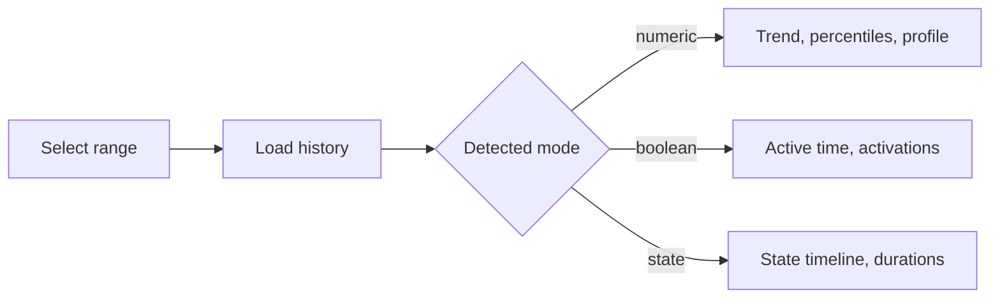

# HistoryView - User Guide


## Purpose

`HistoryView` is a history exploration and visualization module for osysHome. It is used to inspect how an `Object.property` changed over time, compare the selected period with the previous one, and build reusable chart widgets for dashboards and fullscreen pages.

The module is designed to:

- load raw property history from osysHome storage;
- present numeric, boolean, and state-like history in the most suitable chart mode;
- calculate quick summary and advanced analytics for the selected interval;
- filter and export the history table to CSV;
- build reusable widgets from one or more linked properties;
- expose widget pages through `/page/HistoryView`;
- make widgets searchable through the global module search.

> [!IMPORTANT]
> `HistoryView` works with properties that already have history recorded. If a property does not store history, charts and analytics will have little or no data.

---

## What the User Gets

| Capability | What it does |
| --- | --- |
| Property history view | Opens a dedicated analytics page for one property |
| Time presets | Switches quickly between `1h`, `24h`, `7d`, `30d`, `Today`, `Yesterday`, and `All` |
| Main chart | Shows numeric, boolean, or state history depending on property data |
| Analytics tab | Builds medians, percentiles, jumps, trend, hourly activity, and profile charts |
| Table tab | Searches, filters by source, hides unchanged rows, and exports CSV |
| Info tab | Shows metadata, last value, history flag, and previous-period comparison |
| Widgets | Combines several properties into one compact or fullscreen chart |
| Search integration | Finds widgets by name and linked property names |

---

## Interface Overview

Admin page:

```text
/admin/HistoryView
```

Public widget pages:

```text
/page/HistoryView
/page/HistoryView?widget_id=<widget-id>
```

The admin module has two main working modes:

1. `Widgets list` when no object is selected.
2. `Property history page` when an object and property are opened from object properties.

### Main tabs on the property history page

| Tab | Purpose |
| --- | --- |
| `Graph` | Main timeline visualization |
| `Analytics` | Derived metrics and secondary charts |
| `Table` | Full event list with filters |
| `Info` | Property metadata and current summary |

> [!TIP]
> The module is strongest when you use all three views together: chart for trend, analytics for interpretation, and table for exact event auditing.

---

## Quick Start Checklist

- [ ] Make sure the target property stores history in osysHome.
- [ ] Open the object page and go to the property that you want to inspect.
- [ ] Open the history view for that property.
- [ ] Pick a preset range or set `From` and `To` manually.
- [ ] Review the graph and the summary cards.
- [ ] Open `Analytics` if you need percentiles, trends, or activity by hour.
- [ ] Open `Table` if you need exact change records or CSV export.
- [ ] Create a widget if the property should remain visible on dashboards or a fullscreen page.

---

## Viewing Property History

The property page is centered around a single `Object.property`.

### Range controls

You can choose the time interval in several ways:

- preset buttons: `1h`, `24h`, `7d`, `30d`;
- calendar shortcuts: `Today`, `Yesterday`;
- open interval: `All`;
- manual start and end values through `datetime-local` fields.

After changing the interval, click `Apply`.

### Chart behavior by property type

`HistoryView` automatically chooses the most appropriate mode:

| Mode | When it is used | Typical output |
| --- | --- | --- |
| `numeric` | The property has numeric values | Line, column, spline, area, or step chart |
| `boolean` | The property type is `bool` | Timeline rendered as stepped numeric data |
| `state` | Values are non-numeric strings or mixed states | State timeline with generated categories |

### What appears on the chart

- numeric history is plotted as timestamp/value points;
- large numeric datasets may be bucketed automatically;
- boolean and state history are rendered as step-like transitions;
- time is displayed in the browser's local timezone.

> [!NOTE]
> Automatic bucketing keeps charts responsive on long ranges. The module can switch between `raw`, `5m`, `15m`, `1h`, `6h`, and `1d` buckets depending on the dataset size and selected period.

---

## Analytics Tab

The `Analytics` tab extends the raw chart with derived insights.

### Statistics cards

Depending on the data, the page can show:

- median;
- `P10`;
- `P90`;
- standard deviation;
- minimum and maximum points;
- total trend and direction;
- counter-style increment totals;
- binary active-time statistics.

### Secondary charts

| Chart | Meaning |
| --- | --- |
| Hourly activity | How many changes happened in each hour of day |
| Daily profile | Average value by hour of day |
| Increment profile | Positive increments by hour for counter-like data |
| Active profile | Active time by hour for `0/1` signals |
| Sources pie | Distribution of data sources |
| Values pie | Distribution of values or states |
| Duration column | How long each state lasted |

### Typical interpretations

| Property kind | Useful analytics |
| --- | --- |
| Temperature / numeric sensor | `P10`, `P90`, standard deviation, daily profile |
| Energy counter | Trend, increment total, increment-by-hour profile |
| Motion / relay / binary flag | Activation count, active time, longest active interval |
| Text state machine | Values pie and state duration chart |



---

## Table Tab

The `Table` tab is the audit-friendly view of the same range.

Columns:

| Column | Meaning |
| --- | --- |
| `Changed` | Timestamp of the row |
| `Source` | Origin of the update |
| `Transition` | Previous value -> new value |
| `Delta` | Numeric difference when available |
| `State duration` | How long that state lasted until the next row |
| `Current for` | How long the current value has been active |

Available tools:

- text search;
- source filter;
- `Only changes` switch;
- `CSV` export button.

### CSV export

The exported file contains:

```csv
changed,source,previous_value,value,transition,delta,duration,current_for
2026-03-27T08:10:00,RuleEngine,20.5,21.0,20.5 -> 21.0,+0.5,15m,2h 4m
```

> [!TIP]
> CSV export is especially useful when you need to compare history outside osysHome or attach evidence to troubleshooting notes.

---

## Info Tab

The `Info` tab summarizes the current property:

- full property name;
- property description;
- property type;
- whether history is enabled;
- last value;
- last source;
- last change timestamp;
- comparison with the previous period.

If both `From` and `To` are set, `HistoryView` automatically builds a previous-period comparison of the same duration.[^compare]

[^compare]: Example: if you open the last 24 hours, the comparison is built against the preceding 24-hour interval.

---

## Creating a Widget

Widgets turn one or several history series into a reusable chart for dashboards and fullscreen pages.

### Widget creation path

1. Open `/admin/HistoryView`.
2. Click `Create Widget`.
3. Enter a widget name.
4. Select the period.
5. Add one or more linked properties.
6. Optionally assign a per-series chart type.
7. Optionally assign a per-series color.
8. Select the main widget chart type.
9. Configure legend, navigator, range selector, and context menu.
10. Save the widget.

### Widget fields

| Field | Meaning |
| --- | --- |
| `Widget Name` | Visible widget title |
| `Period` | Lookback interval used to build widget data |
| `Linked object` | osysHome object name |
| `Linked property` | Property from that object |
| `Series Type` | Per-property override such as `line` or `step` |
| `Color` | Optional fixed color for one series |
| `Chart Type` | Global fallback chart type |
| `Show Legend` | Enables or hides the legend |
| `Show Navigator` | Enables or hides the Highcharts navigator |
| `Show Range Selector` | Enables or hides range buttons in fullscreen stock charts |
| `Show Context Menu Button` | Enables the Highcharts export menu |

### Supported widget chart types

- `line`
- `column`
- `spline`
- `area`
- `step`
- `pie`

> [!WARNING]
> `pie` is best for compact distribution summaries. For time-based trend comparison across several properties, use `line`, `spline`, `column`, `area`, or `step`.

---

## Viewing Widgets

There are two main widget display modes.

### Fullscreen list page

Open:

```text
/page/HistoryView
```

This page shows all widgets as cards with:

- widget name;
- chart type;
- period;
- linked properties.

### Fullscreen single-widget page

Open:

```text
/page/HistoryView?widget_id=<widget-id>
```

This page renders one widget in a fullscreen layout and adds a `Back` button to the widget list.

### What a widget displays

Each widget shows:

- the last value for each linked property;
- the number of collected entries;
- a combined chart for all configured series;
- theme-aware colors that adapt to the current UI theme.

---

## Search

The module participates in search through the `search` action.

Search can match:

- widget name;
- linked property names;
- JSON-like property metadata stored inside the widget config.

Example queries:

- `Boiler`
- `Climate.outdoor_temp`
- `temperature`

Search results open the corresponding fullscreen widget page.

---

## Example User Scenarios

### Scenario 1. Check why a relay stayed on too long

1. Open the relay property history.
2. Set `Yesterday`.
3. Open `Analytics`.
4. Review `Time in 1`, activation count, and longest active interval.
5. Open `Table` to inspect exact transitions and sources.

### Scenario 2. Build a room climate widget

Add these properties:

- `LivingRoom.temperature`
- `LivingRoom.humidity`
- `LivingRoom.co2`

Suggested settings:

| Setting | Value |
| --- | --- |
| `Chart Type` | `line` |
| `Series Type` for humidity | `area` |
| `Show Legend` | enabled |
| `Show Navigator` | enabled |

### Scenario 3. Review a counter-like property

If a value mostly grows over time, `HistoryView` may treat it as counter-like and show increment totals and an hourly increment profile.

---

## Troubleshooting

> [!WARNING]
> An empty chart does not always mean the module is broken. In many cases it means the target property has no recorded history in the selected range.

### No data is shown

Check:

- the selected object and property are correct;
- history is enabled for that property;
- the chosen time range actually contains changes;
- the property name used in the widget is in `Object.property` format.

### Widget opens but looks incomplete

Check:

- every linked property still exists;
- the widget contains at least one valid property;
- series overrides are valid for the current chart mode;
- the chosen period is not too narrow for rarely changing properties.

### CSV export looks smaller than expected

The export uses the currently filtered table, so search text, source filter, and `Only changes` can reduce the output.

---

## Notes and Limitations

- The property history page is admin-oriented and protected accordingly.
- The widget list and fullscreen widget pages are separate from the admin edit form.
- Previous-period comparison is only calculated when both range boundaries are known.
- Non-numeric values are preserved as display strings, not coerced into fake numbers.
- The module uses Highcharts Stock for interactive chart rendering.

> [!CAUTION]
> A widget configuration that references deleted objects or properties can stop that widget from rendering correctly until the configuration is fixed.

---

## See Also

- [Technical Reference](TECHNICAL_REFERENCE.md)
- [Module index](index.md)
