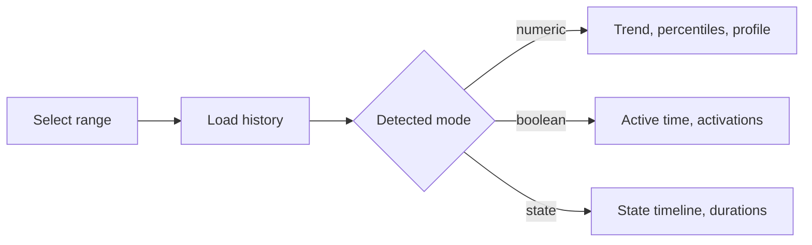

# HistoryView - User Guide


## Purpose

`HistoryView` is a history exploration and visualization module for osysHome. It is used to inspect how an `Object.property` changed over time, compare the selected period with the previous one, and build reusable chart widgets for dashboards and fullscreen pages.

The module is designed to:

- load raw property history from osysHome storage;
- present numeric, boolean, and state-like history in the most suitable chart mode;
- calculate quick summary and advanced analytics for the selected interval;
- filter and export the history table to CSV;
- build reusable widgets from one or more linked properties;
- expose widget pages through `/page/HistoryView`;
- make widgets searchable through the global module search.

> [!IMPORTANT]
> `HistoryView` works with properties that already have history recorded. If a property does not store history, charts and analytics will have little or no data.

---

## What the User Gets

| Capability | What it does |
| --- | --- |
| Property history view | Opens a dedicated analytics page for one property |
| Time presets | Switches quickly between `1h`, `24h`, `7d`, `30d`, `Today`, `Yesterday`, and `All` |
| Main chart | Shows numeric, boolean, or state history depending on property data |
| Analytics tab | Builds medians, percentiles, jumps, trend, hourly activity, and profile charts |
| Table tab | Searches, filters by source, hides unchanged rows, and exports CSV |
| Info tab | Shows metadata, last value, history flag, and previous-period comparison |
| Widgets | Combines several properties into one compact or fullscreen chart |
| Search integration | Finds widgets by name and linked property names |

---

## Interface Overview

Admin page:

```text
/admin/HistoryView
```

Public widget pages:

```text
/page/HistoryView
/page/HistoryView?widget_id=<widget-id>
```

The admin module has two main working modes:

1. `Widgets list` when no object is selected.
2. `Property history page` when an object and property are opened from object properties.

### Main tabs on the property history page

| Tab | Purpose |
| --- | --- |
| `Graph` | Main timeline visualization |
| `Analytics` | Derived metrics and secondary charts |
| `Table` | Full event list with filters |
| `Info` | Property metadata and current summary |

> [!TIP]
> The module is strongest when you use all three views together: chart for trend, analytics for interpretation, and table for exact event auditing.

---

## Quick Start Checklist

- [ ] Make sure the target property stores history in osysHome.
- [ ] Open the object page and go to the property that you want to inspect.
- [ ] Open the history view for that property.
- [ ] Pick a preset range or set `From` and `To` manually.
- [ ] Review the graph and the summary cards.
- [ ] Open `Analytics` if you need percentiles, trends, or activity by hour.
- [ ] Open `Table` if you need exact change records or CSV export.
- [ ] Create a widget if the property should remain visible on dashboards or a fullscreen page.

---

## Viewing Property History

The property page is centered around a single `Object.property`.

### Range controls

You can choose the time interval in several ways:

- preset buttons: `1h`, `24h`, `7d`, `30d`;
- calendar shortcuts: `Today`, `Yesterday`;
- open interval: `All`;
- manual start and end values through `datetime-local` fields.

After changing the interval, click `Apply`.

### Chart behavior by property type

`HistoryView` automatically chooses the most appropriate mode:

| Mode | When it is used | Typical output |
| --- | --- | --- |
| `numeric` | The property has numeric values | Line, column, spline, area, or step chart |
| `boolean` | The property type is `bool` | Timeline rendered as stepped numeric data |
| `state` | Values are non-numeric strings or mixed states | State timeline with generated categories |

### What appears on the chart

- numeric history is plotted as timestamp/value points;
- large numeric datasets may be bucketed automatically;
- boolean and state history are rendered as step-like transitions;
- time is displayed in the browser's local timezone.

> [!NOTE]
> Automatic bucketing keeps charts responsive on long ranges. The module can switch between `raw`, `5m`, `15m`, `1h`, `6h`, and `1d` buckets depending on the dataset size and selected period.

---

## Analytics Tab

The `Analytics` tab extends the raw chart with derived insights.

### Statistics cards

Depending on the data, the page can show:

- median;
- `P10`;
- `P90`;
- standard deviation;
- minimum and maximum points;
- total trend and direction;
- counter-style increment totals;
- binary active-time statistics.

### Secondary charts

| Chart | Meaning |
| --- | --- |
| Hourly activity | How many changes happened in each hour of day |
| Daily profile | Average value by hour of day |
| Increment profile | Positive increments by hour for counter-like data |
| Active profile | Active time by hour for `0/1` signals |
| Sources pie | Distribution of data sources |
| Values pie | Distribution of values or states |
| Duration column | How long each state lasted |

### Typical interpretations

| Property kind | Useful analytics |
| --- | --- |
| Temperature / numeric sensor | `P10`, `P90`, standard deviation, daily profile |
| Energy counter | Trend, increment total, increment-by-hour profile |
| Motion / relay / binary flag | Activation count, active time, longest active interval |
| Text state machine | Values pie and state duration chart |


```mermaid
flowchart LR
    A[Select range] --> B[Load history]
    B --> C{Detected mode}
    C -->|numeric| D[Trend, percentiles, profile]
    C -->|boolean| E[Active time, activations]
    C -->|state| F[State timeline, durations]
```

---

## Table Tab

The `Table` tab is the audit-friendly view of the same range.

Columns:

| Column | Meaning |
| --- | --- |
| `Changed` | Timestamp of the row |
| `Source` | Origin of the update |
| `Transition` | Previous value -> new value |
| `Delta` | Numeric difference when available |
| `State duration` | How long that state lasted until the next row |
| `Current for` | How long the current value has been active |

Available tools:

- text search;
- source filter;
- `Only changes` switch;
- `CSV` export button.

### CSV export

The exported file contains:

```csv
changed,source,previous_value,value,transition,delta,duration,current_for
2026-03-27T08:10:00,RuleEngine,20.5,21.0,20.5 -> 21.0,+0.5,15m,2h 4m
```

> [!TIP]
> CSV export is especially useful when you need to compare history outside osysHome or attach evidence to troubleshooting notes.

---

## Info Tab

The `Info` tab summarizes the current property:

- full property name;
- property description;
- property type;
- whether history is enabled;
- last value;
- last source;
- last change timestamp;
- comparison with the previous period.

If both `From` and `To` are set, `HistoryView` automatically builds a previous-period comparison of the same duration.[^compare]

[^compare]: Example: if you open the last 24 hours, the comparison is built against the preceding 24-hour interval.

---

## Creating a Widget

Widgets turn one or several history series into a reusable chart for dashboards and fullscreen pages.

### Widget creation path

1. Open `/admin/HistoryView`.
2. Click `Create Widget`.
3. Enter a widget name.
4. Select the period.
5. Add one or more linked properties.
6. Optionally assign a per-series chart type.
7. Optionally assign a per-series color.
8. Select the main widget chart type.
9. Configure legend, navigator, range selector, and context menu.
10. Save the widget.

### Widget fields

| Field | Meaning |
| --- | --- |
| `Widget Name` | Visible widget title |
| `Period` | Lookback interval used to build widget data |
| `Linked object` | osysHome object name |
| `Linked property` | Property from that object |
| `Series Type` | Per-property override such as `line` or `step` |
| `Color` | Optional fixed color for one series |
| `Chart Type` | Chart type (built-in or custom from the Custom group) |
| `Show Legend` | Enables or hides the legend |
| `Show Navigator` | Enables or hides the Highcharts navigator |
| `Show Range Selector` | Enables or hides range buttons in fullscreen stock charts |
| `Show Context Menu Button` | Enables the Highcharts export menu |

### Supported widget chart types

- `line`
- `column`
- `spline`
- `area`
- `step`
- `pie`

> [!WARNING]
> `pie` is best for compact distribution summaries. For time-based trend comparison across several properties, use `line`, `spline`, `column`, `area`, or `step`.

---

## Custom chart types

A custom chart type is a named Highcharts render configuration. It appears in the same **Chart Type** dropdown as built-ins (group **Custom**).

Where it applies:

- property history page (`/admin/HistoryView?object=...&name=...`);
- widget form and widget / widget page rendering.

Types are stored in the plugin config (`chart_types`). After save, refresh the page to see them in selectors.

### Create in admin UI

1. Open `/admin/HistoryView`.
2. In **Chart Types**, click **Create Chart Type**.
3. Fill in:

| Field | Description |
| --- | --- |
| **Name** | Label in the Chart Type dropdown |
| **Engine** | `JavaScript transform` or `Options merge (JSON)` |
| **Options (JSON)** | For `options_merge` — Highcharts options object |
| **Transform JS** | For `js` — `function(ctx) { ... }` |

4. Save. The type appears in the list and under Chart Type → Custom.

Edit/delete from the chart types table. Deleting a type unlinks widgets that referenced it (built-in `chart_type` remains).

### Engines

| `engine` | When to use | Behavior |
| --- | --- | --- |
| `options_merge` | Small tweaks to the base chart | Deep-merge JSON onto built-in options |
| `js` | Custom logic (gauge, bands, aggregations) | `function(ctx)` must return full Highcharts options |

> [!NOTE]
> Built-in **Media** (image URL timeline) is a module preset, not a custom type. Custom types support only `js` and `options_merge`.

### Engine: Options merge

Use when the base line/column/area chart is fine and you only need Highcharts tweaks.

Example **Options (JSON)**:

```json
{
  "chart": { "type": "areaspline" },
  "plotOptions": {
    "series": {
      "fillOpacity": 0.25,
      "marker": { "enabled": false }
    }
  },
  "legend": { "enabled": true }
}
```

Rules:

- root must be a JSON object `{}`, not an array;
- nested objects merge recursively; arrays and scalars replace;
- on widgets, merge runs on widget stock options; on the property page, on the built-in mode options.

### Engine: JavaScript transform

Code runs **in the browser** (admin / widget page), not on the server. It must return a Highcharts options object.

**Transform JS** format:

```javascript
function(ctx) {
  // ...
  return { chart: { type: "line" }, series: [] };
}
```

#### `ctx` fields

| Field | Available | Description |
| --- | --- | --- |
| `payload` | property page; on widgets — first property + `title` | History data: `entries`, `series`, `range`, `property_label`, `mode`, … |
| `payloads` | widget | `{ "Object.prop": payload, ... }` for all series |
| `widgetConfig` | widget | Widget config (`name`, `period`, UI flags, …) |
| `baseOptions` | when refining | Already built-in chart options (if any) |
| `theme` | everywhere | Theme/palette colors (`primary`, …) |
| `targetId` | everywhere | DOM container id for `chart.renderTo` |
| `chartHeight` | everywhere | Suggested height |
| `compact` | property page | Compact mode |
| `formatDate` | everywhere | `(tsMs) => string` |
| `labels` | everywhere | Localized labels |
| `xAxisRange` | property page | `{ min, max }` for selected range |
| `Highcharts` | usually widget | Global Highcharts reference |

Typical series access:

```javascript
const seriesMap = (ctx.payload && ctx.payload.series) || {};
const firstKey = Object.keys(seriesMap)[0];
const points = (firstKey && seriesMap[firstKey] && seriesMap[firstKey].data) || [];
// points: [[timestampMs, y], ...]
```

The renderer fills `chart.renderTo` if missing. Types like `gauge` / `pie` / `solidgauge` use `Highcharts.chart` (not Stock).

#### Example: gauge from last value

```javascript
function(ctx) {
  const seriesMap = (ctx.payload && ctx.payload.series) || {};
  const key = Object.keys(seriesMap)[0];
  const raw = (key && seriesMap[key] && seriesMap[key].data) || [];
  let last = 0;
  for (let i = raw.length - 1; i >= 0; i--) {
    const p = raw[i];
    const y = Array.isArray(p) ? p[1] : (p && p.y);
    if (typeof y === "number" && isFinite(y)) { last = y; break; }
  }
  return {
    chart: { type: "solidgauge", height: ctx.chartHeight || 320 },
    title: { text: (ctx.payload && ctx.payload.property_label) || "" },
    pane: {
      startAngle: -90,
      endAngle: 90,
      background: [{ outerRadius: "100%", innerRadius: "60%", shape: "arc" }]
    },
    yAxis: {
      min: 0,
      max: Math.max(100, last * 1.2),
      stops: [[0.3, "#55BF3B"], [0.7, "#DDDF0D"], [0.9, "#DF5353"]],
      lineWidth: 0,
      tickWidth: 0,
      title: { text: null }
    },
    series: [{ name: "Value", data: [last], dataLabels: { format: "{y:.1f}" } }],
    credits: { enabled: false },
    tooltip: { enabled: false }
  };
}
```

#### Example: min/max band around the series

```javascript
function(ctx) {
  const seriesMap = (ctx.payload && ctx.payload.series) || {};
  const key = Object.keys(seriesMap)[0];
  const raw = (key && seriesMap[key] && seriesMap[key].data) || [];
  const points = [];
  for (let i = 0; i < raw.length; i++) {
    const p = raw[i];
    const x = Array.isArray(p) ? p[0] : (p && p.x);
    const y = Array.isArray(p) ? p[1] : (p && p.y);
    if (typeof x === "number" && typeof y === "number" && isFinite(y)) points.push([x, y]);
  }
  const windowSize = Math.max(3, Math.min(31, Math.floor(points.length / 20) || 5));
  const half = Math.floor(windowSize / 2);
  const band = [];
  const mid = [];
  for (let i = 0; i < points.length; i++) {
    const from = Math.max(0, i - half);
    const to = Math.min(points.length, i + half + 1);
    let min = Infinity, max = -Infinity, sum = 0, n = 0;
    for (let j = from; j < to; j++) {
      const y = points[j][1];
      if (y < min) min = y;
      if (y > max) max = y;
      sum += y; n += 1;
    }
    band.push([points[i][0], min, max]);
    mid.push([points[i][0], n ? sum / n : null]);
  }
  const theme = ctx.theme || {};
  return {
    chart: { height: ctx.chartHeight || 420 },
    title: { text: (ctx.payload && ctx.payload.property_label) || "" },
    xAxis: { type: "datetime" },
    yAxis: { title: { text: null } },
    series: [
      { name: "Range", type: "arearange", data: band, color: theme.primary || "#4e79a7", fillOpacity: 0.2, lineWidth: 0, enableMouseTracking: false },
      { name: "Avg", type: "line", data: mid, color: theme.primary || "#4e79a7" }
    ],
    navigator: { enabled: !ctx.compact },
    rangeSelector: { enabled: !ctx.compact, inputEnabled: false },
    credits: { enabled: false }
  };
}
```

### Selecting a type in the UI

On the history page and in the widget form there is one **Chart Type** list:

- built-ins (`line`, `step`, `media`, …);
- **Custom** — your types.

Widget storage:

- `custom_chart_type_id` — custom type id;
- `chart_type` — fallback built-in (usually `line`) if the custom type is missing.

### Errors and debugging

- If transform throws, the property page shows a failure note; details are in the browser console.
- `transform_js` is required for `engine=js`; non-empty `options` object is required for `options_merge`.
- Code must not rely on Node/server modules.
- To inspect data, open property history and check Network → `history_data`.

### Create via MCP

HistoryView collection `chart_types`:

1. `osys_plugin_entity_schema` / `osys_plugin_capabilities`.
2. `osys_plugin_validate_entity` → `osys_plugin_upsert_entity`.
3. Useful invoke ops: `history_data`, `list_presets`, `resolve_chart`.

Minimal payload:

```json
{
  "name": "My gauge",
  "engine": "js",
  "transform_js": "function(ctx) { return { chart: { type: 'solidgauge' }, series: [{ data: [0] }] }; }",
  "options": {}
}
```

For `options_merge`:

```json
{
  "name": "Soft area",
  "engine": "options_merge",
  "options": { "chart": { "type": "areaspline" }, "plotOptions": { "series": { "fillOpacity": 0.2 } } }
}
```

> [!WARNING]
> `transform_js` runs in the admin browser. Do not paste untrusted code.

---

## Viewing Widgets

There are two main widget display modes.

### Fullscreen list page

Open:

```text
/page/HistoryView
```

This page shows all widgets as cards with:

- widget name;
- chart type;
- period;
- linked properties.

### Fullscreen single-widget page

Open:

```text
/page/HistoryView?widget_id=<widget-id>
```

This page renders one widget in a fullscreen layout and adds a `Back` button to the widget list.

### What a widget displays

Each widget shows:

- the last value for each linked property;
- the number of collected entries;
- a combined chart for all configured series;
- theme-aware colors that adapt to the current UI theme.

---

## Search

The module participates in search through the `search` action.

Search can match:

- widget name;
- linked property names;
- JSON-like property metadata stored inside the widget config.

Example queries:

- `Boiler`
- `Climate.outdoor_temp`
- `temperature`

Search results open the corresponding fullscreen widget page.

---

## Example User Scenarios

### Scenario 1. Check why a relay stayed on too long

1. Open the relay property history.
2. Set `Yesterday`.
3. Open `Analytics`.
4. Review `Time in 1`, activation count, and longest active interval.
5. Open `Table` to inspect exact transitions and sources.

### Scenario 2. Build a room climate widget

Add these properties:

- `LivingRoom.temperature`
- `LivingRoom.humidity`
- `LivingRoom.co2`

Suggested settings:

| Setting | Value |
| --- | --- |
| `Chart Type` | `line` |
| `Series Type` for humidity | `area` |
| `Show Legend` | enabled |
| `Show Navigator` | enabled |

### Scenario 3. Review a counter-like property

If a value mostly grows over time, `HistoryView` may treat it as counter-like and show increment totals and an hourly increment profile.

---

## Troubleshooting

> [!WARNING]
> An empty chart does not always mean the module is broken. In many cases it means the target property has no recorded history in the selected range.

### No data is shown

Check:

- the selected object and property are correct;
- history is enabled for that property;
- the chosen time range actually contains changes;
- the property name used in the widget is in `Object.property` format.

### Widget opens but looks incomplete

Check:

- every linked property still exists;
- the widget contains at least one valid property;
- series overrides are valid for the current chart mode;
- the chosen period is not too narrow for rarely changing properties.

### CSV export looks smaller than expected

The export uses the currently filtered table, so search text, source filter, and `Only changes` can reduce the output.

---

## Notes and Limitations

- The property history page is admin-oriented and protected accordingly.
- The widget list and fullscreen widget pages are separate from the admin edit form.
- Previous-period comparison is only calculated when both range boundaries are known.
- Non-numeric values are preserved as display strings, not coerced into fake numbers.
- The module uses Highcharts Stock for interactive chart rendering.

> [!CAUTION]
> A widget configuration that references deleted objects or properties can stop that widget from rendering correctly until the configuration is fixed.

---

## See Also

- [Technical Reference](TECHNICAL_REFERENCE.md)
- [Module index](index.md)
