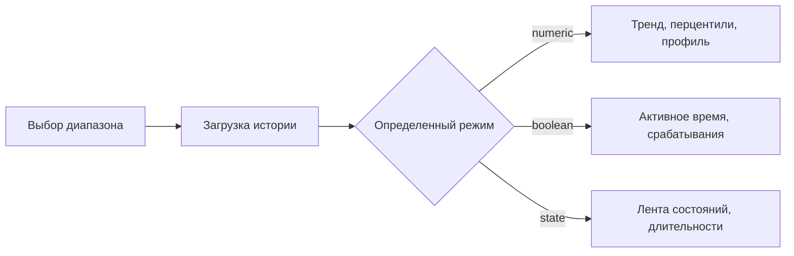

# HistoryView - Руководство пользователя


## Назначение

`HistoryView` — это модуль просмотра истории и визуализации данных для osysHome. Он нужен, чтобы анализировать, как менялось значение `Object.property` во времени, сравнивать выбранный период с предыдущим и собирать переиспользуемые виджеты с графиками для дашбордов и полноэкранных страниц.

Модуль позволяет:

- загружать историю свойства из хранилища osysHome;
- автоматически выбирать подходящий режим отображения для числовых, булевых и строковых состояний;
- считать краткие сводки и расширенную аналитику по выбранному интервалу;
- фильтровать таблицу событий и выгружать ее в CSV;
- собирать виджеты из одной или нескольких связанных характеристик;
- публиковать страницы виджетов через `/page/HistoryView`;
- находить виджеты через глобальный поиск по модулям.

> [!IMPORTANT]
> `HistoryView` работает с теми свойствами, у которых реально сохраняется история. Если свойство не пишет историю, графики и аналитика будут пустыми или почти пустыми.

---

## Что получает пользователь

| Возможность | Что делает |
| --- | --- |
| Просмотр истории свойства | Открывает отдельную страницу аналитики для одного свойства |
| Быстрые интервалы | Позволяет быстро переключаться между `1h`, `24h`, `7d`, `30d`, `Сегодня`, `Вчера` и `Все` |
| Основной график | Показывает числовую, булеву или состоянийную историю в подходящем режиме |
| Вкладка `Аналитика` | Строит медианы, перцентили, скачки, тренд, активность по часам и профиль |
| Вкладка `Таблица` | Ищет, фильтрует по источнику, скрывает неизменившиеся строки и экспортирует CSV |
| Вкладка `Сведения` | Показывает метаданные, последнее значение, флаг истории и сравнение с прошлым периодом |
| Виджеты | Объединяют несколько свойств в компактный или полноэкранный график |
| Интеграция с поиском | Находит виджеты по названию и по связанным свойствам |

---

## Обзор интерфейса

Административная страница:

```text
/admin/HistoryView
```

Публичные страницы виджетов:

```text
/page/HistoryView
/page/HistoryView?widget_id=<id-виджета>
```

У модуля два основных режима работы:

1. `Список виджетов`, когда объект не выбран.
2. `Страница истории свойства`, когда из объекта открыто конкретное свойство.

### Основные вкладки страницы истории свойства

| Вкладка | Назначение |
| --- | --- |
| `График` | Основная временная визуализация |
| `Аналитика` | Производные метрики и дополнительные графики |
| `Таблица` | Полный список событий с фильтрами |
| `Сведения` | Метаданные свойства и текущая сводка |

> [!TIP]
> Максимальную пользу модуль дает в связке: график показывает тренд, аналитика помогает его интерпретировать, а таблица подтверждает все точными событиями.

---

## Быстрый старт

- [ ] Убедитесь, что у нужного свойства включено сохранение истории в osysHome.
- [ ] Откройте страницу объекта и перейдите к интересующему свойству.
- [ ] Откройте просмотр истории для этого свойства.
- [ ] Выберите быстрый интервал или задайте `С` и `По` вручную.
- [ ] Посмотрите основной график и карточки сводки.
- [ ] Перейдите в `Аналитику`, если нужны перцентили, тренды или активность по часам.
- [ ] Перейдите в `Таблицу`, если нужны точные записи изменений или экспорт CSV.
- [ ] Создайте виджет, если это свойство должно оставаться на дашборде или отдельной странице.

---

## Просмотр истории свойства

Страница свойства строится вокруг одного `Object.property`.

### Управление диапазоном

Интервал можно задать несколькими способами:

- кнопками быстрых периодов: `1h`, `24h`, `7d`, `30d`;
- календарными кнопками: `Сегодня`, `Вчера`;
- открытым интервалом: `Все`;
- ручным вводом дат и времени в поля `datetime-local`.

После изменения диапазона нажмите `Применить`.

### Поведение графика в зависимости от типа данных

`HistoryView` сам выбирает подходящий режим:

| Режим | Когда используется | Что обычно показывает |
| --- | --- | --- |
| `numeric` | У свойства есть числовые значения | Линейный, столбчатый, сглаженный, областной или ступенчатый график |
| `boolean` | Тип свойства равен `bool` | Ступенчатую временную ленту в числовом виде |
| `state` | Значения нечисловые, строковые или смешанные | Ленту состояний с автоматически собранными категориями |

### Что попадает на график

- числовая история строится как пары `время/значение`;
- большие наборы данных могут автоматически агрегироваться по бакетам;
- булевы и состоянийные свойства показываются как последовательность переходов;
- время отображается в локальном часовом поясе браузера.

> [!NOTE]
> Автоматическое агрегирование нужно для отзывчивости интерфейса. Модуль может переключаться между `raw`, `5m`, `15m`, `1h`, `6h` и `1d` в зависимости от объема данных и длины интервала.

---

## Вкладка «Аналитика»

Вкладка `Аналитика` дополняет исходный график вычисленными выводами.

### Карточки статистики

В зависимости от данных страница может показать:

- медиану;
- `P10`;
- `P90`;
- стандартное отклонение;
- точки минимума и максимума;
- итоговый тренд и направление;
- приросты для свойств, похожих на счетчик;
- статистику активного времени для `0/1` сигналов.

### Дополнительные графики

| График | Смысл |
| --- | --- |
| Активность по часам | Сколько изменений происходило в каждый час суток |
| Суточный профиль | Среднее значение по каждому часу |
| Профиль приростов | Положительные приросты по часам для счетчиков |
| Профиль активности | Время в активном состоянии по часам для `0/1` сигналов |
| Круговая по источникам | Распределение по источникам изменений |
| Круговая по значениям | Распределение по значениям или состояниям |
| Длительность состояний | Сколько времени длилось каждое состояние |

### Как это обычно читать

| Тип свойства | Что полезно смотреть |
| --- | --- |
| Температура / числовой датчик | `P10`, `P90`, стандартное отклонение, суточный профиль |
| Счетчик энергии / расхода | Тренд, суммарный прирост, профиль приростов по часам |
| Движение / реле / бинарный флаг | Число срабатываний, активное время, самый длинный активный интервал |
| Текстовое состояние | Круговую по значениям и график длительностей состояний |



---

## Вкладка «Таблица»

`Таблица` — это режим точного аудита для того же диапазона.

Колонки:

| Колонка | Значение |
| --- | --- |
| `Changed` | Время строки |
| `Source` | Источник изменения |
| `Transition` | Предыдущее значение -> новое значение |
| `Delta` | Числовая разница, если она вычислима |
| `State duration` | Сколько длилось состояние до следующей записи |
| `Current for` | Как долго текущее значение остается активным |

Доступные инструменты:

- текстовый поиск;
- фильтр по источнику;
- переключатель `Только изменения`;
- кнопка экспорта `CSV`.

### Экспорт CSV

Файл содержит, например, такие колонки:

```csv
changed,source,previous_value,value,transition,delta,duration,current_for
2026-03-27T08:10:00,RuleEngine,20.5,21.0,20.5 -> 21.0,+0.5,15m,2h 4m
```

> [!TIP]
> Экспорт CSV удобен, когда нужно сравнить данные вне osysHome, отправить отчет или приложить историю к разбору инцидента.

---

## Вкладка «Сведения»

Во вкладке `Сведения` собрана краткая информация о текущем свойстве:

- полное имя свойства;
- описание свойства;
- тип свойства;
- включена ли история;
- последнее значение;
- последний источник;
- время последнего изменения;
- сравнение с предыдущим периодом.

Если заданы обе границы диапазона, `HistoryView` автоматически строит сравнение с предыдущим периодом той же длины.[^compare-ru]

[^compare-ru]: Например, если открыт диапазон за последние 24 часа, сравнение строится с предыдущими 24 часами.

---

## Создание виджета

Виджеты превращают одну или несколько историй в переиспользуемый график для дашбордов и полноэкранных страниц.

### Как создать виджет

1. Откройте `/admin/HistoryView`.
2. Нажмите `Создать виджет`.
3. Введите имя виджета.
4. Выберите период.
5. Добавьте одно или несколько связанных свойств.
6. При необходимости задайте тип серии для отдельного свойства.
7. При необходимости задайте цвет серии.
8. Выберите основной тип графика виджета.
9. Настройте легенду, навигатор, селектор диапазона и контекстное меню.
10. Сохраните виджет.

### Поля виджета

| Поле | Значение |
| --- | --- |
| `Widget Name` | Заголовок виджета |
| `Period` | Интервал, из которого берутся данные |
| `Linked object` | Имя объекта osysHome |
| `Linked property` | Свойство выбранного объекта |
| `Series Type` | Переопределение типа отдельной серии |
| `Color` | Необязательный фиксированный цвет серии |
| `Chart Type` | Основной тип графика по умолчанию |
| `Show Legend` | Показывать или скрывать легенду |
| `Show Navigator` | Показывать или скрывать навигатор Highcharts |
| `Show Range Selector` | Показывать или скрывать кнопки выбора диапазона в полноэкранном графике |
| `Show Context Menu Button` | Включать или отключать меню экспорта Highcharts |

### Поддерживаемые типы графиков виджета

- `line` — линейный
- `column` — столбчатый
- `spline` — сглаженный
- `area` — областной
- `step` — ступенчатый
- `pie` — круговой

> [!WARNING]
> Тип `pie` лучше подходит для компактного отображения распределений. Для анализа трендов во времени по нескольким свойствам лучше использовать `line`, `spline`, `column`, `area` или `step`.

---

## Просмотр виджетов

У виджетов есть два основных режима отображения.

### Полноэкранный список виджетов

Откройте:

```text
/page/HistoryView
```

На странице выводятся карточки всех виджетов с:

- названием;
- типом графика;
- периодом;
- списком связанных свойств.

### Полноэкранная страница одного виджета

Откройте:

```text
/page/HistoryView?widget_id=<id-виджета>
```

Эта страница показывает один виджет во весь экран и добавляет кнопку `Назад` для возврата к списку.

### Что показывает виджет

Каждый виджет выводит:

- последнее значение по каждому связанному свойству;
- количество собранных записей;
- объединенный график по всем сериям;
- цвета, адаптирующиеся под текущую тему интерфейса.

---

## Поиск

Модуль участвует в поиске через действие `search`.

Поиск может совпасть:

- с названием виджета;
- с именем связанного свойства;
- с JSON-подобными метаданными свойства, сохраненными в конфигурации виджета.

Примеры запросов:

- `Boiler`
- `Climate.outdoor_temp`
- `temperature`

Результаты поиска открывают соответствующую полноэкранную страницу виджета.

---

## Примеры сценариев

### Сценарий 1. Проверить, почему реле было включено слишком долго

1. Откройте историю свойства реле.
2. Выберите `Вчера`.
3. Перейдите в `Аналитику`.
4. Посмотрите метрики активного времени, число срабатываний и самый длинный активный интервал.
5. Откройте `Таблицу`, чтобы увидеть точные переходы и источники.

### Сценарий 2. Собрать климатический виджет комнаты

Добавьте такие свойства:

- `LivingRoom.temperature`
- `LivingRoom.humidity`
- `LivingRoom.co2`

Рекомендуемые настройки:

| Параметр | Значение |
| --- | --- |
| `Chart Type` | `line` |
| `Series Type` для влажности | `area` |
| `Show Legend` | включено |
| `Show Navigator` | включено |

### Сценарий 3. Разобрать свойство, похожее на счетчик

Если значение в основном растет со временем, `HistoryView` может распознать его как счетчик и показать суммарный прирост и почасовой профиль приростов.

---

## Диагностика проблем

> [!WARNING]
> Пустой график не всегда означает ошибку модуля. Очень часто это просто означает, что у выбранного свойства нет записанной истории в заданном интервале.

### Данные не отображаются

Проверьте:

- правильно ли выбраны объект и свойство;
- включено ли сохранение истории у этого свойства;
- действительно ли в выбранном диапазоне были изменения;
- записано ли свойство в виджете в формате `Object.property`.

### Виджет открывается, но выглядит неполным

Проверьте:

- существуют ли все связанные свойства;
- есть ли в конфигурации хотя бы одно корректное свойство;
- подходят ли переопределения типов серий к текущему режиму графика;
- не слишком ли узкий выбран период для редко меняющихся свойств.

### В CSV меньше строк, чем ожидалось

Экспорт использует текущую отфильтрованную таблицу, поэтому поиск, фильтр по источнику и флажок `Только изменения` уменьшают результат.

---

## Замечания и ограничения

- Страница истории свойства ориентирована на администратора и защищена соответствующим доступом.
- Список виджетов и полноэкранные страницы виджетов отделены от формы редактирования в админке.
- Сравнение с предыдущим периодом считается только тогда, когда известны обе границы диапазона.
- Нечисловые значения сохраняются как строки отображения и не превращаются в искусственные числа.
- Для интерактивной отрисовки используется Highcharts Stock.

> [!CAUTION]
> Если виджет ссылается на удаленный объект или свойство, он может перестать корректно строиться, пока конфигурация не будет исправлена.

---

## См. также

- [Техническое описание](TECHNICAL_REFERENCE.ru.md)
- [Индекс модуля](index.ru.md)
